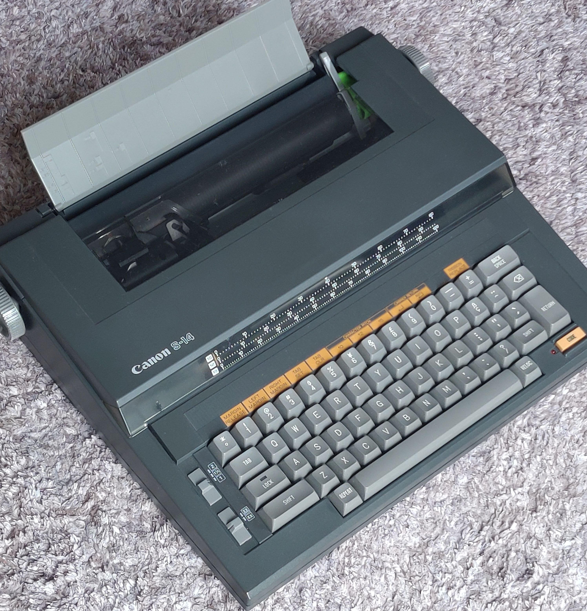
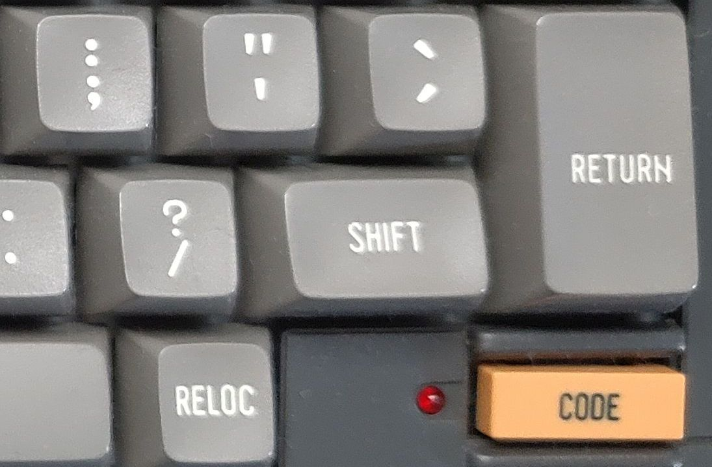

# Objective

This project aims to remodel a 1980s electronic typewriter into an online terminal in order to recreate the computing environment of the 1970s.
The project uses a Canon electronic typewriter Model S-14 which employs a daisy-wheel impact printing mechanism, manufactured in 1986.

 
# Technical approrch

It looks the keyboard is the only available device to order printing operation, my aproach is to interfare the keyboard matrix with additionaly equipped switing device. 
An Arduino-based controller manipulates CMOS analog switches placed between scan lines and sense lines of the keyboard matrix to print characters sent from a host computer.
The controller also monitors user input by tracking behavior on the scan and sense lines, and transmits the input characters to the host.

# keyboard matrix and scan code

The keyboard matrix consists of eight scan lines and eight sense lines. Each key are maped on a pair of one scan line and one sense line. Each scan line is sequencially activated one by one. The controler knows which key is pressed by checking the sense line state at the timing each scan line is activated. 
The following table shows the key mapping in the matrix on the unit. 

|scan\sense|pin12(COL0)|pin11(COL1)|pin10(COL2)|pin9(COL3)|pin8(COL4)|pin7(COL5)|pin6(COL6)|pin5(COL7)|
|:---------:|:--------:|:---------:|:---------:|:--------:|:--------:|:--------:|:--------:|:--------:|
|pin21(ROW0)|REP       |A          |I          |Q         |Y         |6         |/         |TAB       |
|pin20(ROW1)|SHIFT     |B          |J          |R         |Z         |7         |^         |DEL       |
|pin19(ROW2)|LOCK      |C          |K          |S         |0         |8         |-         |REPEAT    |
|pin18(ROW3)|          |D          |L          |T         |1         |9         |=         |BS        |
|pin17(ROW4)|          |E          |M          |U         |2         |,         |β         |CODE      |
|pin16(ROW5)|          |F          |N          |V         |3         |.         |          |          |
|pin15(ROW6)|          |G          |O          |W         |4         |,         |°         |          |
|pin14(ROW7)|          |H          |P          |X         |5         |.         |space     |          |

In the Arduino internal process, a key press is represented by the intermediate byte of information called the scan code.
Below is the bit structure of the scan code.

|Bit7|Bit6|Bit5|Bit4|Bit3|bit2|Bit1|Bit0|
|----|----|----|----|----|----|----|----|
|0   |0   |C[2]|C[1]|C[0]|R[2]|R[1]|R[0]|

C[i] means bit i in the binary encoded colmn number, R[j] means bit j in the binary encoded row number.

# Handshaking

Since the printing speed of the typewriter is usually much slower than the host computer, we have to implement some mechanism to synchronaize the data rate between them. The mechanism makes the host computer wait sending character untile the typewriter has processed the last character.
In order to know the state of mechanical behavior in the typewriter, a couple of logic signal on the embeded controller IC7 (HD6301Y) on the main typewriter control board are monitored by the adapter. I have discoverd these signals by some oscilloscoping.

|Signal|Function|Connection to Arduino|
|------|--------|---------------------|
|IC7.Pin24|Goes low while typing a character|D3|
|IC7.Pin16|Goes high while feeding paper|D7|

Regarding the handshaking between Arduino and the host, I initially intended to use the CTS signal on the serial port, but I couldn't get the host side to handle CTS-based handshaking. I decided to use ACK-based handshaking,   where Arduino sends back an ACK character (0x06) upon processing a character from the host.

# Printing usupported characters

Because the typewriter was originally not intended to be used with computers, several characters defined in the ASCII code table were missing. To cope with this limitation, I have implemented a method to express unsupported characters by overtyping multiple caracters. 
Below shows the unsupported characters and the replaced overtyping combination I used. 

|Original character|Replacement|
|------------------|-----------|
|'<'               |'(' and '-'|
|'>'               |')' and '-'|
|'{'               |'(' and '='|
|'}'               |')' and '='|
|'['               |'(' and '_'|
|']'               |')' and '_'|
 
# Inputting unsupported characters 

There is a special button named CODE on the keyboard.

The original function of the button is to bring the typewriter into special mode in which you can change some operating parameters such as Left and Right Margins, TAB position, character pitch, etc. I named the mode "CODE mode".         
Since pressing any of the alphabet keys when the typewriter is in CODE mode doesn't make printing action, I used CODE mode for inputting the unsupported characters and some ASCII control codes. Below shows the key functions in CODE mode I implemented.

|Key      |Function in CODE mode     |
|---------|--------------------------|
|B        |Send CTRL-B (ESC) to host |
|C        |Send CTRL-B (ESC) to host |
|D        |Send CTRL-B (ESC) to host |
|E        |Send CTRL-B (ESC) to host |
|F        |Send CTRL-B (ESC) to host |
|J        |behaves as '<' key        |
|K        |behaves as '>' key        |
|L        |behaves as '[' key        |
|L with SHIFT|behaves as '{' key        | 
|M        |behaves as ']' key        |
|M with SHIFT|behaves as '}' key        |  

By the way, though pressing alphabet keys in CODE mode doesn't print, some variation in behavior results, as shown in the following table. Program code in Arduino absorbs these variations.  

|Key|Behavior in CODE mode|
|--|:---|
|A|sounds beep|
|B|Print a blank character then exit CODE mode|
|C|sounds beep and exits CODE mode|
|D-I|sounds beep|
|J-M|Do nothing and exit CODE mode|
|N-Z|sounds beep|

# Sumary of adapter interface

|pin#|in/out|signal function    |main board connection  |
|----|------|-------------------|-----------------------|
|1   |      |                   |                       |
|2   |      |                   |                       |
|3   |in    |+feed in progress  |IC7.Pin16              |
|4   |      |                   |                       |
|5   |      |                   |                       |
|6   |      |                   |                       |
|7   |in    |-print in progress |IC7.pin24              |
|8   |pass. |KBD matrix ROW0    |FFC.pin21              |
|9   |pass. |KBD matrix ROW1    |FFC.pin20              |
|10  |pass. |KBD matrix ROW2    |FFC.pin19              |
|11  |pass. |KBD matrix ROW3    |FFC.pin18              |
|12  |pass. |KBD matrix ROW4    |FFC.pin17              |
|13  |pass. |KBD matrix ROW6    |FFC.pin16              |
|14  |pass. |KBD matrix ROW6    |FFC.pin15              |
|15  |pass. |KBD matrix ROW7    |FFC.pin14              |
|16  |pass. |KBD matrix COL0    |FFC.pin13              |
|17  |pass. |KBD matrix COL1    |FFC.pin12              |
|18  |pass. |KBD matrix COL2    |FFC.pin11              |
|19  |pass. |KBD matrix COL3    |FFC.pin10              |
|20  |pass. |KBD matrix COL4    |FFC.pin9               |
|21  |pass. |KBD matrix COL5    |FFC.pin8               |
|22  |pass. |KBD matrix COL6    |FFC.pin7               |
|23  |pass. |KBD matrix COL7    |FFC.pin6               |
|24  |power |ground             |FFC.pin5               |
|25  |      |                   |FFC.pin4               |
|26  |in    |-shift lock        |FFC.pin3               |
|27  |in    |-CODE mode         |FFC.pin2               |
|28  |power |power supply(+5V)  |FFC.pin1               |
